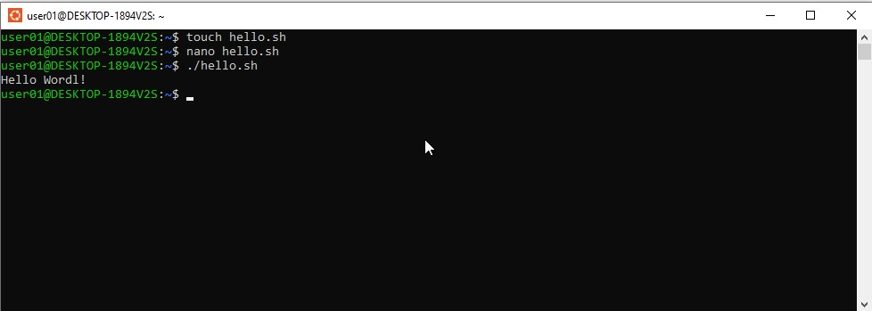
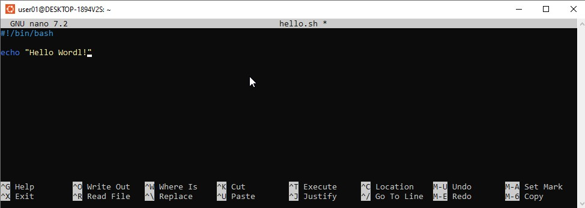
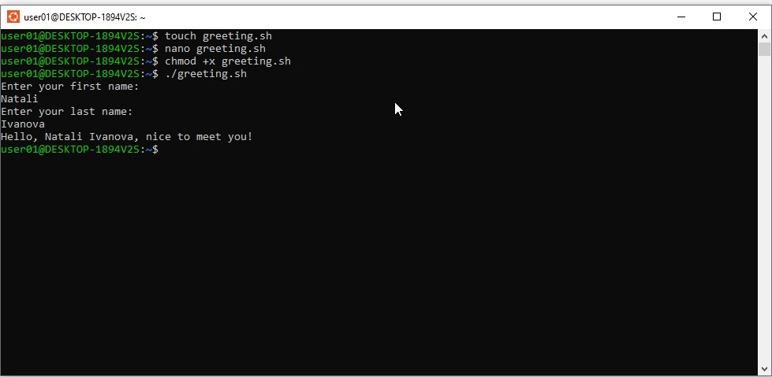
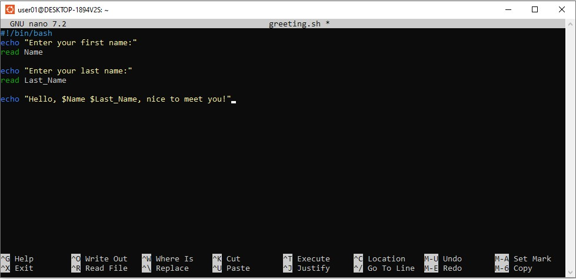
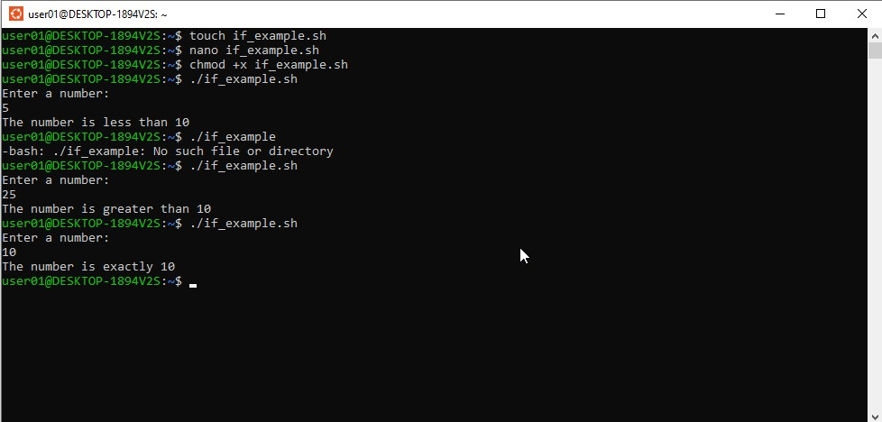
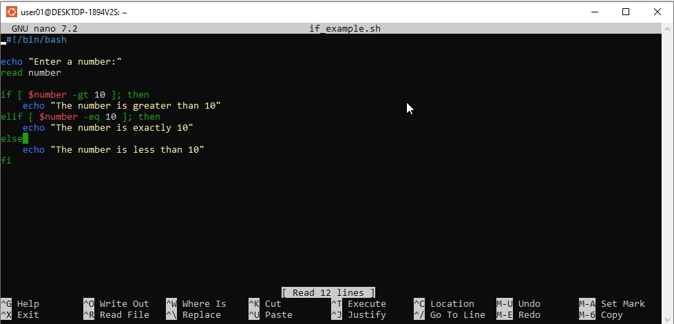
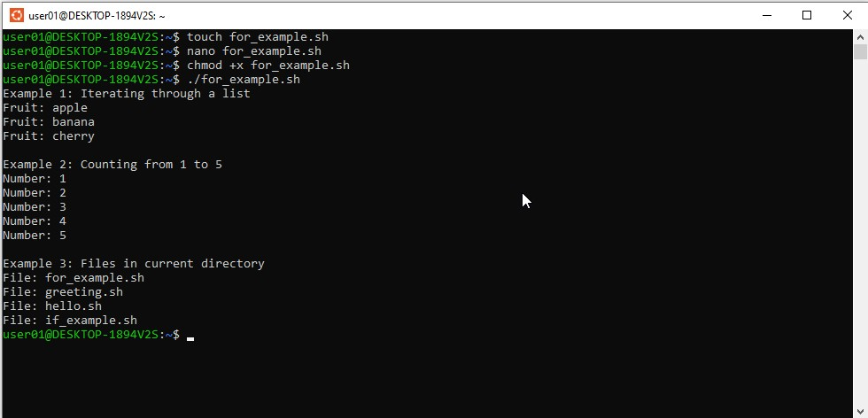
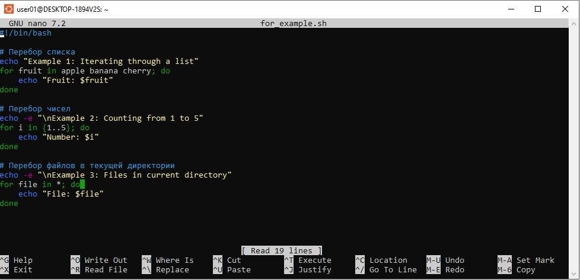
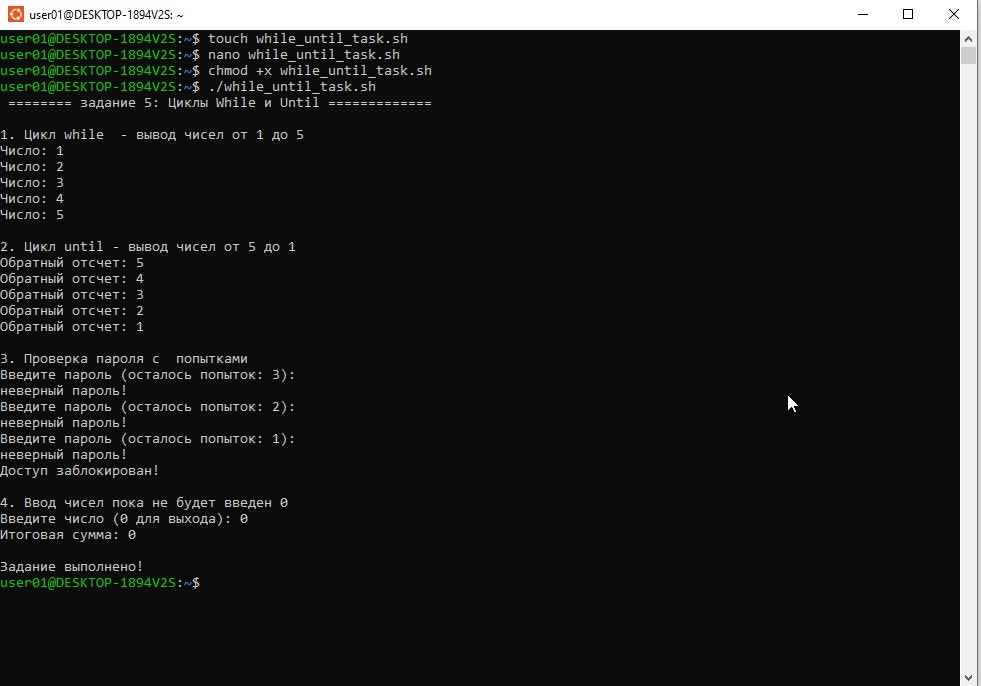
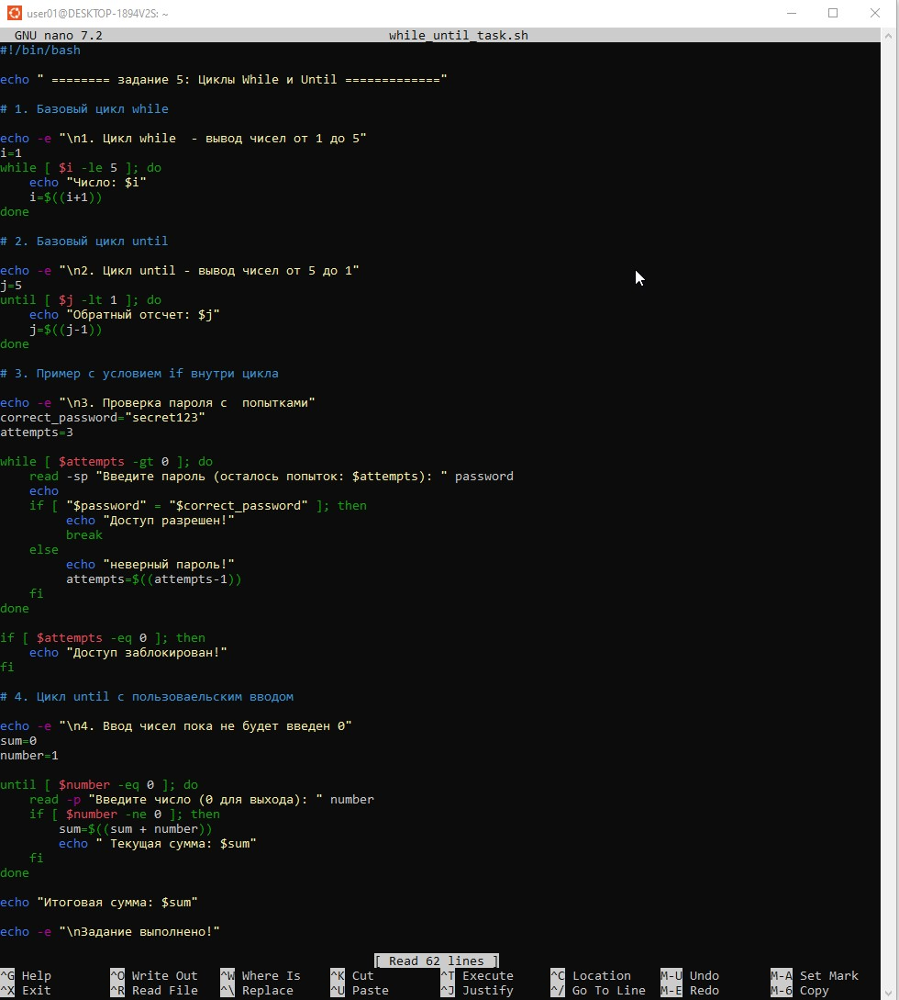

# **Лабораторная работа: Bash. Базовый инструмент скриптов в Linux**

## **Цель работы**
Освоение базовых возможностей Bash-скриптов в операционной системе Linux, включая создание исполняемых файлов, работу с переменными, использование условий и различных типов циклов.

---

## **Задание 1: Создание простого скрипта**
Создать исполняемый файл, который при запуске выводит на экран фразу "Hello World!".

---

## **Задание 2: Скрипт с пользовательским вводом**
Написать скрипт, который запрашивает у пользователя имя и фамилию, после чего выводит персонализированное приветствие в формате: "Hello, [Name], [Last_Name], nice to meet you".

---

## **Задание 3: Использование условий if**
Написать скрипт с использованием условного оператора if для сравнения чисел. Скрипт должен запрашивать у пользователя число и сообщать, больше ли оно 10, равно 10 или меньше 10.

---

## **Задание 4: Цикл for**
Создать скрипт, демонстрирующий работу цикла for в трех различных вариантах: перебор элементов списка, перебор числового диапазона и перебор файлов в текущей директории.

---

## **Задание 5: Циклы while и until**
Разработать скрипт, использующий циклы while и until. В скрипте должны быть реализованы: простой счетчик, проверка пароля с ограниченным количеством попыток и суммирование чисел до ввода нуля.

---

## **Выводы**
В ходе выполнения лабораторной работы были успешно освоены основные принципы создания и выполнения Bash-скриптов в Linux. Были изучены ключевые конструкции языка, включая переменные, условные операторы и различные типы циклов, что позволяет автоматизировать рутинные задачи в операционной системе.

